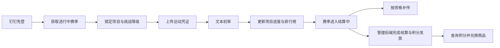

# Flame Sport Pheno 客户后端

`flame-sport-pheno-be` 是企业运动赛季平台的客户侧后端服务，基于 FastAPI、SQLModel 和异步 MySQL 构建。它负责钉钉免登、赛季参与、运动凭证、文本初审、排行榜、积分商城、结算期补传、用户通知和本地图片资源等客户业务。

> **项目状态**
>
> 当前约定的客户后端能力已经完成。本仓库不承载完整的管理后台：赛季配置、人工终审、赛季结算、积分发放和礼品履约等管理业务由独立管理后端负责；本仓库的 `/admin` 路由仅提供资源管理和单条凭证立即初审等内部支撑能力。

## 1. 核心能力

| 业务模块 | 已实现能力 |
| --- | --- |
| 登录与用户 | 钉钉企业内部 H5 免登、开发模式本地登录、首次用户与部门初始化及认证缓存 |
| 赛季参与 | 当前赛季查询、报名期限判断、项目锁定、统一挑战等级锁定和项目完成进度查询 |
| 凭证管理 | 上传配置查询、JPEG/PNG/WebP 凭证上传、同项目同运动日期重传、当前与历史记录查询、归属校验和 WebP 存储 |
| 文本初审 | DeepSeek 定时初审、过往赛季待审凭证的管理端立即初审、进度分配与回补、初审失败通知创建 |
| 结算期补传 | 查询结算中赛季的有效补传资格，按原凭证补交图片与备注，并在事务内消费资格 |
| 排行榜 | 定时生成当前赛季排行榜快照，统计有效初审或终审通过凭证，并支持通用月初、月末阶段型项目口径 |
| 积分商城 | 商品查询、用户积分流水查询、并发安全的积分兑换和待发放状态写入 |
| 通知与建议 | 钉钉 Markdown 工作通知投递、结果检查、失败重试，以及用户建议提交 |
| 图片资源 | 头像、项目图标、商品图片、运动凭证和固定活动海报的安全读取、转换与本地持久化 |

客户侧主流程如下：



赛季状态按 `未开始 -> 进行中 -> 结算中 -> 已结束` 流转。只有 `status = 1` 的赛季属于当前赛季；结算中的凭证进入历史记录，并可通过管理端开放的补传资格进行补交。

---

## 2. 服务边界

| 边界 | 职责 |
| --- | --- |
| 本客户后端 | 客户 API、登录态、凭证与图片存储、文本初审、排行榜快照、积分兑换、通知投递和用户建议 |
| 独立管理后端 | 赛季与项目配置、人工终审、补传资格管理、赛季结算、积分发放、礼品履约和建议处理 |
| 钉钉开放平台 | 企业内部应用免登、员工与部门资料、头像来源和 Markdown 工作通知 |
| DeepSeek | 根据项目规则与用户运动备注生成结构化初审结果；不接收凭证图片和用户 ID |
| MySQL | 保存用户、赛季参与、凭证、进度、排行榜快照、积分流水、通知和补传资格等业务数据 |
| 本地资源卷 | 持久化头像、项目图标、商品图片、凭证图片和活动海报 |

`/flame/api/admin` 是 Docker 内部管理端支撑路由，目前没有独立管理员认证。生产环境必须通过 Docker 网络访问，并在公网 Nginx 中阻断该前缀，不能把它直接暴露给客户端。

---

## 3. 技术架构

主要技术组件如下：

- Python 3.11、FastAPI 和 Uvicorn。
- SQLModel、SQLAlchemy `AsyncSession`、MySQL 8.4 和 `asyncmy`。
- Pydantic Settings、HTTPX、OpenAI 兼容客户端和 Pillow。

业务代码保持以下单向调用关系：

```text
router -> service -> repository -> model
```

| 目录 | 职责 |
| --- | --- |
| `app/routers/` | HTTP 路由、参数解析、鉴权和依赖注入 |
| `app/services/` | 业务校验、跨表流程、事务提交与回滚 |
| `app/repositories/` | 异步查询、关联查询、行锁、写入和 `flush` |
| `app/models/` | SQLModel 数据表映射 |
| `app/core/` | 配置、数据库、钉钉、认证缓存、图片存储和后台任务 |
| `app/main.py` | 应用创建、路由注册和生命周期管理 |
| `assets/` | 本地运行期图片资源；生产环境由 Docker 具名卷持久化 |
| `description/` | 业务、API、数据库和开发运维文档 |

应用启动时会创建缺失的数据表和资源目录，然后按配置启动认证缓存清理、钉钉 token 预热、通知投递、排行榜刷新和文本初审任务。

---

## 4. 快速开始

### 4.1 准备环境

本地开发需要 Python 3.11 和可访问的 MySQL 8.4 数据库。在项目根目录执行：

```bash
python -m venv .venv
source .venv/bin/activate
pip install -r requirements.txt
cp .env.example .env
```

开发模式至少需要在 `.env` 中确认以下配置：

```dotenv
APP_MODE=development
DATABASE_URL=mysql+asyncmy://<用户名>:<密码>@127.0.0.1:3307/flame_sport_pheno?charset=utf8mb4
LLM_PRELIMINARY_REVIEW_ENABLED=false
```

`development` 模式不访问钉钉，登录接口会把 `auth_code` 直接作为数据库中已有的 `user.id` 查询，因此本地联调可以不配置钉钉凭证。

配置模块始终读取仓库根目录的 `.env`。即使从 `app/` 目录或 IDE 启动，也不会改为读取 `app/.env`。

### 4.2 启动服务

推荐从项目根目录启动：

```bash
uvicorn app.main:app --host 127.0.0.1 --port 8000 --reload
```

启动后可访问：

| 入口 | 地址 |
| --- | --- |
| 健康检查 | `http://127.0.0.1:8000/flame/api/` |
| Swagger UI | `http://127.0.0.1:8000/flame/api/docs` |
| ReDoc | `http://127.0.0.1:8000/flame/api/redoc` |
| OpenAPI JSON | `http://127.0.0.1:8000/flame/api/openapi.json` |

MySQL 容器和完整 Compose 环境分别参见 [MySQL Docker 说明](description/dev/mysql_docker.md)与 [Docker Compose 部署](description/dev/docker_compose.md)。

---

## 5. 配置说明

完整配置模板以[后端环境变量模板](.env.example)为准。主要配置分组如下：

| 配置分组 | 环境变量 |
| --- | --- |
| 应用与数据库 | `PROJECT_NAME`、`APP_MODE`、`DATABASE_URL`、`DB_ECHO` |
| 登录缓存 | `AUTH_CACHE_TTL_SECONDS`、`AUTH_CACHE_CLEANUP_INTERVAL_SECONDS` |
| 赛季规则 | `SEASON_PARTICIPATION_ALLOWED_DAYS`、`ACTIVE_SEASON_CONFIG_EDIT_WINDOW_HOURS` |
| 钉钉登录与通知 | `DINGTALK_CLIENT_ID`、`DINGTALK_CLIENT_SECRET`、`DINGTALK_AGENT_ID` 及各超时、刷新和检查间隔 |
| 文本初审 | `DEEPSEEK_API_KEY`、`DEEPSEEK_BASE_URL`、`DEEPSEEK_MODEL`、`LLM_PRELIMINARY_REVIEW_*` |
| 排行榜 | `LEADERBOARD_REFRESH_ENABLED`、`LEADERBOARD_REFRESH_ON_STARTUP`、`LEADERBOARD_REFRESH_INTERVAL_SECONDS` |
| 图片缓存 | `IMAGE_CACHE_MAX_AGE_SECONDS` |

`ACTIVE_SEASON_CONFIG_EDIT_WINDOW_HOURS` 按 `Asia/Shanghai` 的赛季开始日 `00:00` 起算。保护期内会拒绝项目锁定、等级锁定、普通凭证上传、结算期补传、商品兑换和首次用户初始化；建议提交仍然允许。

Docker 镜像不会复制仓库 `.env`，生产配置必须由 Compose 或运行环境显式注入。不得提交真实数据库密码、钉钉密钥或 DeepSeek API Key。

---

## 6. API 导航

所有接口使用公共前缀 `/flame/api`。除存活检查和登录接口外，客户业务接口通常需要传入：

```http
Authorization: auth_code
```

| 路由 | 主要用途 | 接口文档 |
| --- | --- | --- |
| `/auth` | 登录和认证缓存 | [鉴权接口](description/api/auth.md) |
| `/user` | 用户子路由存活校验 | [用户接口](description/api/user.md) |
| `/season` | 当前赛季与参与状态 | [赛季接口](description/api/season.md) |
| `/project` | 项目、规则、锁定、等级和完成进度 | [项目接口](description/api/project.md) |
| `/proof` | 上传配置、凭证上传、当前与历史记录 | [凭证接口](description/api/proof.md) |
| `/supplement` | 结算中赛季补传资格查询与补交 | [补传接口](description/api/supplement.md) |
| `/leaderboard` | 当前赛季排行榜快照 | [排行榜接口](description/api/leaderboard.md) |
| `/shop` | 商品、积分流水与兑换 | [商城接口](description/api/shop.md) |
| `/suggestion` | 用户建议提交 | [用户建议接口](description/api/suggestion.md) |
| `/image` | 客户侧受保护图片读取 | [图片接口](description/api/image.md) |
| `/admin` | Docker 内部资源管理与立即初审 | [管理端接口](description/api/admin.md) |
| `/` | 服务健康检查 | [健康检查接口](description/api/health.md) |

请求字段、响应结构、错误码和缓存规则不在本 README 重复维护，请以对应 API 文档和运行时 OpenAPI 为准。

---

## 7. 后台任务

| 任务 | 启动条件 | 作用 |
| --- | --- | --- |
| 认证缓存清理 | 始终启动 | 清理过期 `auth_code -> user_id` 登录态 |
| 钉钉 token 预热 | `APP_MODE=production` | 定时刷新企业内部应用 access token |
| 工作通知投递 | 生产模式且钉钉凭证与 `AgentId` 完整 | 发送 Markdown 通知、查询结果并重试失败任务 |
| 排行榜刷新 | `LEADERBOARD_REFRESH_ENABLED=true` | 全量刷新当前赛季排行榜快照 |
| 文本初审 | `LLM_PRELIMINARY_REVIEW_ENABLED=true` | 扫描当前进行中赛季的待初审凭证并更新进度 |

通知采用数据库任务状态流转和至少一次投递语义。定时文本初审只扫描当前进行中赛季；结算中或已结束赛季遗留的 `pending` 凭证由管理端内部接口按凭证 ID 立即初审。

---

## 8. 数据与资源

数据库结构以[数据库设计目录](description/db/)中的表文档为事实来源。应用启动时的 `SQLModel.metadata.create_all()` 只能为新数据库创建缺失表，**不会迁移已有表结构**；已有环境必须先备份，再按 [MySQL Docker 说明](description/dev/mysql_docker.md)执行对应迁移。

图片资源目录如下：

```text
assets/images/
  avatar/       用户头像
  poster/       固定活动海报
  product/      商品图片
  project_icon/ 项目图标
  proof_record/ 按赛季 ID 分目录保存的运动凭证
```

服务端会校验上传图片的真实格式；用户头像、项目图标、运动凭证和活动海报会按各自规则统一转换为 WebP。Docker Compose 将整个 `/workspace/assets` 挂载为具名卷；代码部署、资源备份和数据库备份需要分别处理。详细规则参见[本地资源目录说明](description/dev/assets.md)。

---

## 9. 开发与验证

开始修改前必须阅读[Agent 工作指引](AGENTS.md)，并按文档地图定位对应业务、API、数据库和开发资料。实现保持异步调用和 `router -> service -> repository -> model` 分层，不在 Router 中承载跨表业务规则。

当前仓库不提交临时测试脚本。文档或代码变更后，至少执行与范围匹配的检查；基础语法检查可以使用：

```bash
python -m compileall -q app
```

接口变更还应启动应用检查 OpenAPI，并同步更新对应的 `description/api/` 与 `description/business/` 文档。数据库表结构只有在需求明确涉及数据库设计时才允许调整。

---

## 10. 文档入口

| 文档 | 用途 |
| --- | --- |
| [项目文档地图](description/README.md) | 按业务主题查找业务、API、数据库、代码入口和开发资料 |
| [项目概况](description/project.md) | 理解业务流程、核心领域对象、代码分层和系统限制 |
| [项目文档撰写规范](description/document-style.md) | 统一 Markdown 结构、格式、表达和维护方式 |
| [本地运行说明](description/dev/local_run.md) | 配置、登录模式、启动方式和后台任务 |
| [Docker Compose 部署](description/dev/docker_compose.md) | 容器拓扑、网络边界、持久化、备份与恢复 |
| [文档维护说明](description/dev/documentation.md) | 功能变更对应的文档同步范围 |

第一次参与开发时，建议按“项目概况 -> 相关业务文档 -> API 契约 -> 数据库设计 -> Router 与分层实现”的顺序阅读。

---

## 11. 运行边界

- 登录态、钉钉 access token 和部分业务缓存保存在单进程内存中，多实例部署不会共享状态。
- 图片保存在本地文件系统或 Docker 具名卷中，尚未接入对象存储。
- `/admin` 路由依赖 Docker 网络与 Nginx 隔离；开放到其他网络前必须增加独立管理鉴权。
- 商品兑换当前以积分流水为业务凭据，不在客户后端维护库存、订单或独立兑换记录。
- 钉钉通知在极端网络中断场景下可能重复投递，消费端应按业务通知语义容忍至少一次送达。

这些约束不影响当前客户侧既定流程，但部署扩容、接入对象存储或扩展交易能力时需要优先评估。
